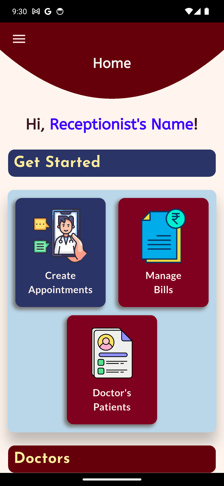
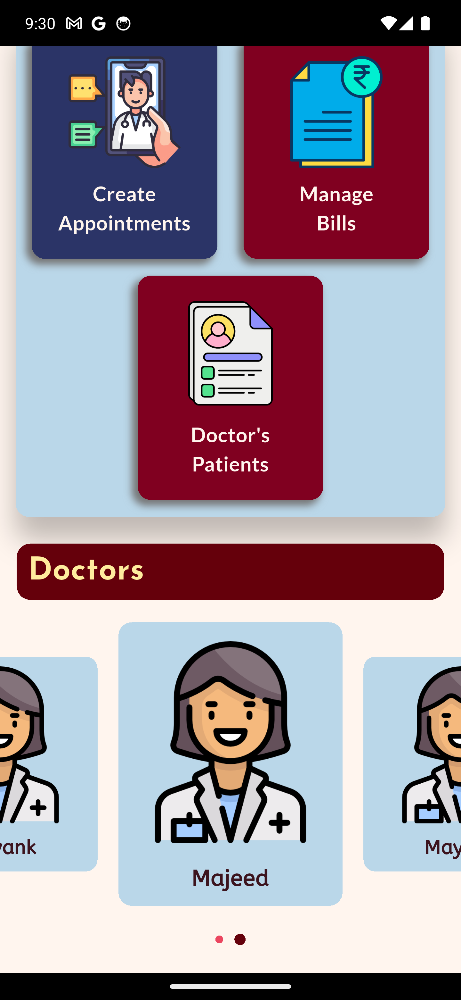
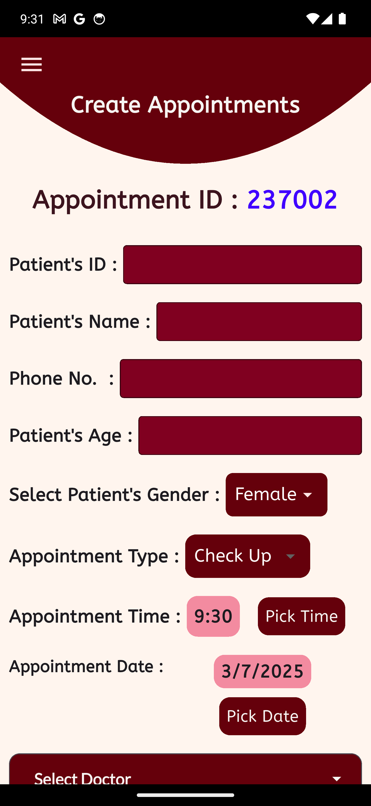
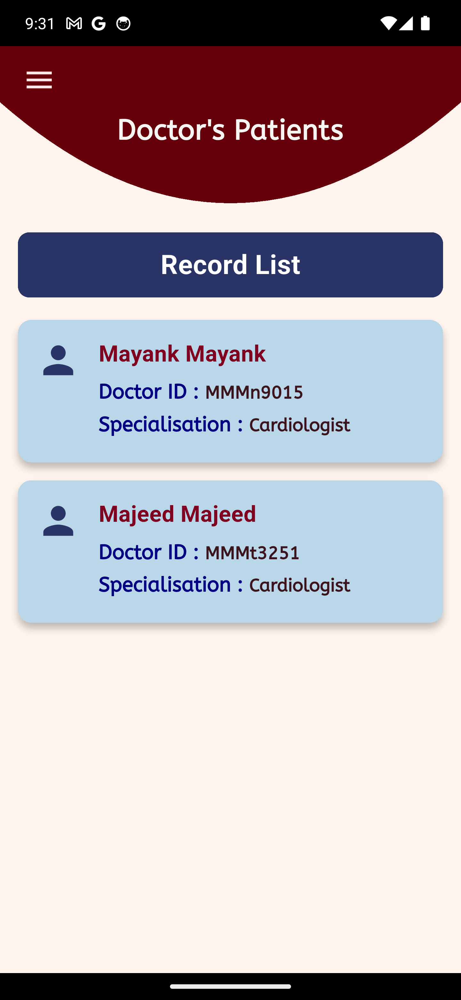
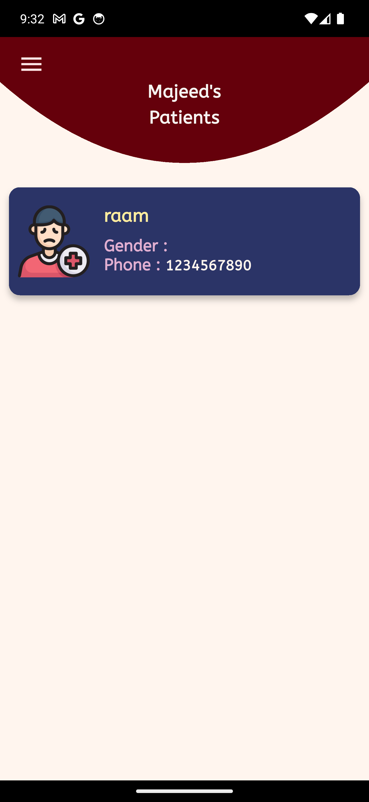
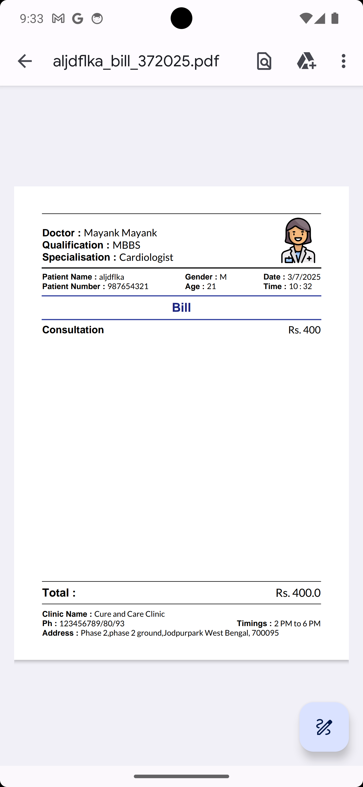
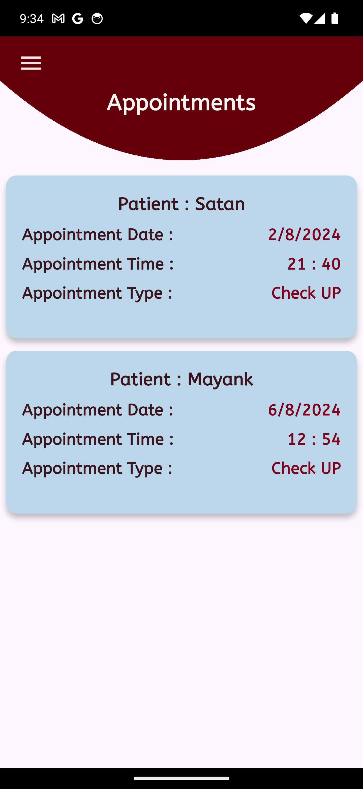
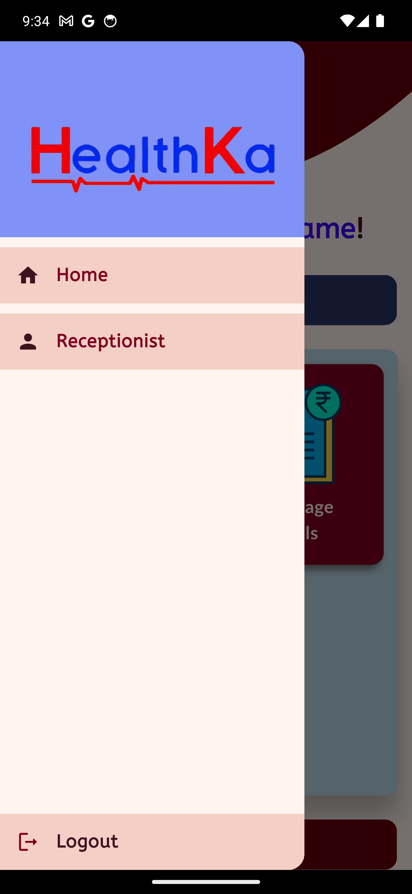

# Health Ka Receptionist

A comprehensive Flutter application designed to streamline hospital and clinic operations by providing receptionists with digital tools to manage appointments, billing, and patient records efficiently.

---
## Table of Contents

- [🏥 Overview](#-overview)
- [✨ Features](#-features)
- [🖼️ Screenshots](#-screenshots)
- [🛠️ Technology Stack](#️-technology-stack)
- [📁 Project Structure](#-project-structure)
- [📋 Key Models](#-key-models)
- [🚀 Getting Started](#-getting-started)
  - [Prerequisites](#prerequisites)
  - [Installation](#installation)

---
## 🏥 Overview

**Health Ka Receptionist** is a mobile app built with Flutter that serves as a digital assistant for medical receptionists. It simplifies the management of doctor appointments, patient billing, and administrative tasks in healthcare facilities.

---

## ✨ Features

- **Appointment Management:** Create, schedule, and manage doctor appointments.
- **Billing System:** Generate and manage patient bills with PDF export capabilities.
- **Doctor Management:** View and manage doctor profiles and specializations.
- **Patient Records:** Maintain comprehensive patient information and history.
- **Saved Appointments:** Track and manage previously scheduled appointments.
- **Modern UI:** Clean, intuitive, and mobile-optimized interface.
- **Doctor Carousel:** Interactive carousel display of available doctors.
- **Navigation Drawer:** Easy access to all app features.
- **Splash Screen:** Professional app launch experience.
- **Local Storage:** SQLite database for offline data management.
- **Cloud Integration:** Firebase for data synchronization.
- **PDF Generation:** Create and export billing documents.
- **Shared Preferences:** User settings and preferences storage.

---
## 🖼️ Screenshots
<p>
  
  
  
  
  
  
  
  
</p>
---
## 🛠️ Technology Stack

- **Frontend:** Flutter (Dart)
- **Database:** SQLite (local), Firebase/Firestore (cloud)
- **PDF & Printing:** `pdf`, `printing` packages
- **Other Packages:** `carousel_slider`, `flutter_typeahead`, `shared_preferences`, `permission_handler`, `path_provider`

---

## 📁 Project Structure
- **assets/** : Images and static resources
- **constants/** : App constants and configurations
- **data/** : Data management and shared preferences
- **dialogBox/** : Custom dialog components
- **functions/** : Business logic and API calls
- **models/** : Data models (Doctor, Patient, Bill, Appointment)
- **screens/** : UI screens and pages
- **widgets/** : Reusable UI components
---

## 📋 Key Models

- **Doctor:** Name, ID, specialization, qualification, image, contact info
- **Patient:** Demographics, contact, medical history, appointments
- **Appointment:** Doctor, patient, date, time, status
- **Bill:** Patient, services, charges, payment status

---

## 🚀 Getting Started

### Prerequisites

- Flutter SDK (>=3.4.1 <4.0.0)
- Dart SDK
- Android Studio or VS Code
- Firebase project setup

### Installation

1. **Clone the repository**
```
git clone https://github.com/mayankKushwaha13/healthKaReceptionist.git
cd healthKaReceptionist
```
2. **Install dependencies**
```
flutter pub get
```

3. **Configure Firebase**
- Set up a Firebase project
- Add your `google-services.json` (Android) and `GoogleService-Info.plist` (iOS)
- Update `firebase_options.dart` with your configuration

4. **Run the application**
```
flutter run
```

---

**Health Ka Receptionist** – Digitizing healthcare administration, one appointment at a time.

